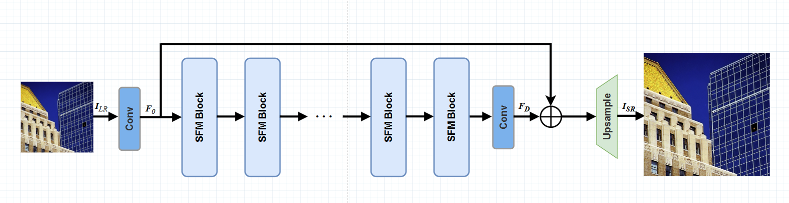
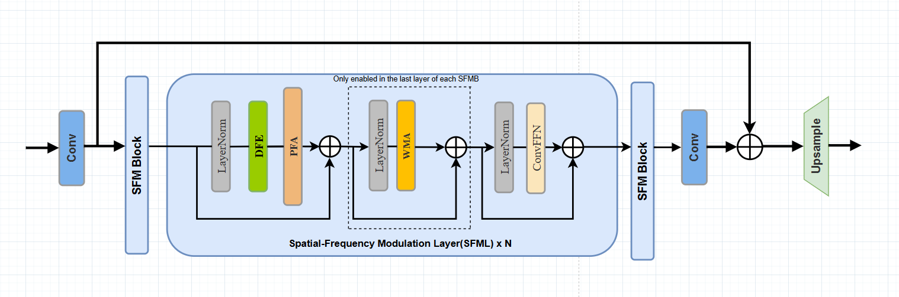
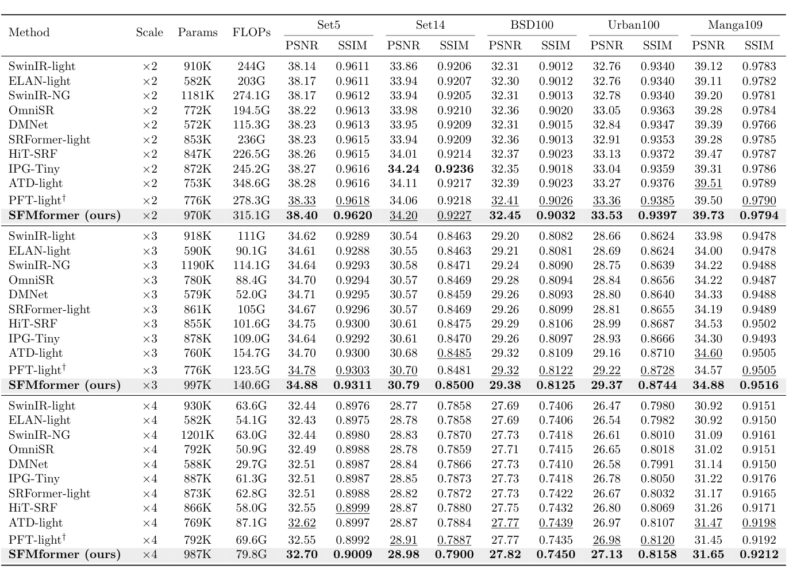

# SFMformer: [Your Paper Title Here]

> Official PyTorch implementation of **"SFMformer: ..."**.

[](https://www.python.org/)
[](https://pytorch.org/)
[](https://developer.nvidia.com/cuda-downloads)
[](LICENSE)

---

## 🔍 Overview

SFMformer is an efficient image super-resolution network that performs **spatial-frequency dual-domain modulation**. The model takes the Progressive Focused Transformer (PFT) as its backbone, and is further augmented with the **Dual Feature Extraction (DFE)** module from HiT-SR and the **Wavelet-based Multi-scale Attention (WMA)** module from DMNet, jointly capturing long-range dependencies in the spatial domain and high-frequency details in the wavelet domain.

### Overall Architecture

<p align="center">
  
</p>

### SFM Block Detail

<p align="center">
  
</p>

---

## 🛠️ Requirements

| Component   | Version          |
| ----------- | ---------------- |
| **OS**      | Windows 11 / Ubuntu 20.04+ |
| **Python**  | 3.9              |
| **PyTorch** | 2.8.0 + cu128    |
| **CUDA**    | 12.8             |

The installation is based on [PFT-SR](https://github.com/labshuhanggu/Progressive-Focused-Transformer-for-Single-Image-Super-Resolution) and [BasicSR](https://github.com/XPixelGroup/BasicSR).

---

## 📦 Installation

```bash
# 1. Clone this repository
git clone https://github.com/JoeyYCH/SFMformer.git
cd SFMformer

# 2. Create and activate conda environment
conda create -n SFM python=3.9 -y
conda activate SFM

# 3. Install PyTorch (CUDA 12.8 build)
pip install torch==2.8.0 torchvision==0.23.0 \
    --index-url https://download.pytorch.org/whl/cu128

# 4. Install other dependencies
pip install -r requirements.txt

# 5. Install BasicSR framework (in develop mode)
python setup.py develop

# 6. Compile custom CUDA kernel for sparse matrix multiplication
cd ./ops_smm
python setup.py install
cd ..
```

---

## 📂 Dataset Preparation

Please download the training and testing datasets from [HiT-SR](https://github.com/XiangZ-0/HiT-SR).

---

## 📁 Pretrained Models

Pretrained weights will be released at [Google Drive](your-link-here).

After downloading, place them under:

```
experiments/pretrained_models/
├── 101_SFMformer_SRx2_scratch.pth
├── 102_SFMformer_SRx3_finetune.pth
└── 103_SFMformer_SRx4_finetune.pth
```

---

## 🚀 Training

We train SFMformer from scratch at ×2 scale, then finetune for ×3 and ×4 using the ×2 weights as initialization (following the SwinIR convention).

```bash
# ×2 training (from scratch)
python basicsr/train.py -opt options/train/101_SFMformer_SRx2_scratch.yml

# ×3 training (finetune from x2)
python basicsr/train.py -opt options/train/102_SFMformer_SRx3_finetune.yml

# ×4 training (finetune from x2)
python basicsr/train.py -opt options/train/103_SFMformer_SRx4_finetune.yml
```

---

## 🧪 Testing

```bash
# ×2 testing
python basicsr/test.py -opt options/test/101_SFMformer_SRx2_scratch.yml

# ×3 testing
python basicsr/test.py -opt options/test/102_SFMformer_SRx3_finetune.yml

# ×4 testing
python basicsr/test.py -opt options/test/103_SFMformer_SRx4_finetune.yml
```

Reconstructed SR images will be saved under `results/`.

---

## 📊 Results

Quantitative comparison with state-of-the-art lightweight SR methods on benchmark datasets (PSNR / SSIM on the Y channel). **Bold** indicates the best, and <u>underline</u> indicates the second best.

<p align="center">
  
</p>

---

## 📝 Citation

If you find this work useful for your research, please consider citing:

```bibtex
@article{huang2026sfmformer,
  title={SFMformer: [Your Full Paper Title]},
  author={Huang, [Your Name] and ...},
  journal={...},
  year={2026}
}
```

---

## 🙏 Acknowledgements

This implementation is built upon the following excellent works:

- [PFT-SR](https://github.com/labshuhanggu/Progressive-Focused-Transformer-for-Single-Image-Super-Resolution) — Progressive Focused Transformer
- [BasicSR](https://github.com/XPixelGroup/BasicSR) — Image / video restoration toolbox
- [HiT-SR](https://github.com/XiangZ-0/HiT-SR) — Hierarchical Transformer for Super-Resolution
- [DMNet](https://github.com/PRIS-CV/DMNet) — Dual-domain Modulation Network

We sincerely thank the authors for releasing their code.
